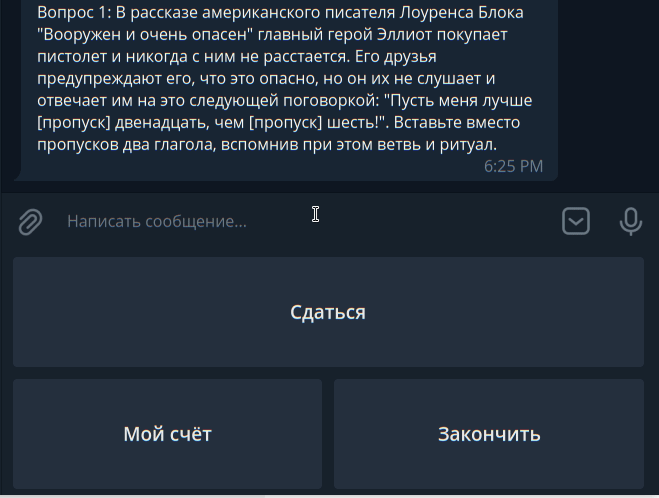

# Telegram-бот с викториной

Отвечает на вопросы пользователей, связанные с работой издательства.

## Примеры работы

### Telegram
[Telegram-бот @tolegu_devman_quiz_bot](https://t.me/tolegu_devman_quiz_bot)



### Вконтакте

[Страница с ботом]()

### Как установить

Код является свободным, ты можешь установить его и пользоваться. Для этого тебе понадобится:

1. Установить Python 3.10+. [см. как установить (англ.)](https://realpython.com/installing-python/), а [здесь для Debian-based (рус.)](http://userone.ru/?q=node/41).

2. Получить Telegram API ключ для клиентского бота, который будет вести диалог с пользователями. Для этого напиши [Отцу ботов](https://telegram.me/BotFather) и ответь на его вопросы.

3. Также тебе понадобится Telegram-бот для ведения логов, логгер-бот. Действуй по аналогии с предыдущим пунктом.

4. Получить ключ Вконтакте для доступа к сообщениям группы, см. [инструкцию](https://vk.com/dev/bots_docs?f=1.1.%20%D0%9F%D0%BE%D0%BB%D1%83%D1%87%D0%B5%D0%BD%D0%B8%D0%B5%20%D0%BA%D0%BB%D1%8E%D1%87%D0%B0%20%D0%B4%D0%BE%D1%81%D1%82%D1%83%D0%BF%D0%B0)

5. Установить ключи в переменных окружения (см. ниже).
6. Установить виртуальную базу данных Redis, см. [инструкцию](https://docs.redis.com/latest/rs/references/client_references/client_python/) 

Далее, скачай репозиторий к себе, установи и активируй виртуальное окружение:
```
    python3 -m venv env
    source env/bin/activate
```
установи необходимые библиотеки, указанные в файле requirements.txt:
```
    pip install -r requirements.txt
```
перейди в папку проекта и запусти Telegram-бот:
```
    python3 bot_tg.py
```
Если у тебя возникает ошибка *chat not found* — напиши своему боту в Telegram. Пока ты не напишешь ему, у него нет чата с тобой. Это защита от рекламных рассылок, поэтому боты не могут написать пользователям первыми.

Бот Вконтакте запускается так:
```
    python3 bot_vk.py
```


## Переменные окружения

Для улучшения уровня безопасности все ключи размещай в переменных окружения, в файле *.env*:

```
TG_TOKEN="<token of client bot>"
TG_LOGGER_TOKEN="<token of logger bot>"
TG_LOGGING_CHAT_ID="<id of the chat where to send logs>"
VK_TOKEN="<token of VK bot>"
REDIS_HOST="<redis host>"
REDIS_PORT=<redis host port>
REDIS_PASSWORD="<redis password>"
```


## Деплой

Разместить скрипт можно на [Heroku](https://devcenter.heroku.com/articles/getting-started-with-python) (не рекомендую) или на сервере, см. например, [инструкцию для Django](https://habr.com/ru/post/501414/), из которой достаточно взять только часть для установки скрипта, опустив установку базы данных и т.п.

## Цель проекта

Код написан в образовательных целях на онлайн-курсе для веб-разработчиков [dvmn.org](https://dvmn.org/).
